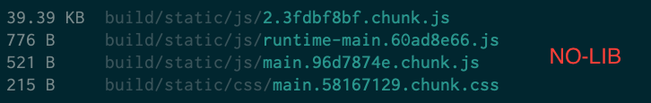
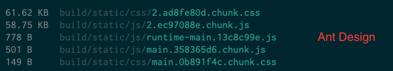
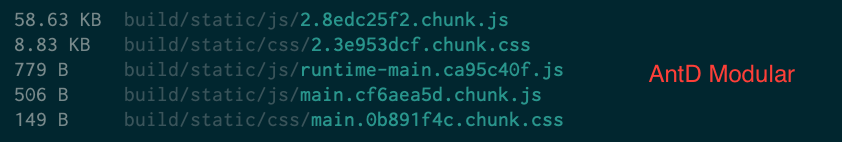
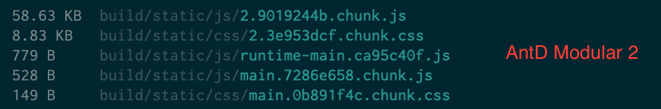

# Bundle Size Test UI Lib

This is to test how bundle size will effect when using UI libraries.

For the test, I will going to use one component which is button from different lib and share the bundle size.

## 01-No-Lib

In this example I have not using any library, just added simple style to button and here is the bundle size.

## 02-AntD

In this example I am using Ant Design, imported button & style and here is the bundle size.

## 02-AntD-Modular

In this example I am using Ant Design, imported only button & it's style and here is the bundle size.

I also tried to import button in two different component and check how it handle duplicate imports, here is the bundle size.

