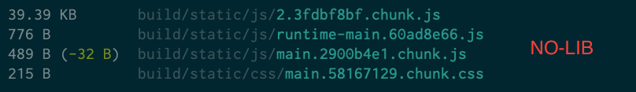

# Bundle Size Test UI Lib

This is to test how bundle size will effect when using UI libraries.

For the test, I used one component which is button from different lib and below is the bundle size table, for more info checkout the detail below.

| Library | Chunk CSS | Chunk JS | | Main CSS | Main JS | Run Time JS |
|---|---|---|---|---|---|---|
| [No Lib](#no-lib) | | 39.39 Kb | | 215 B | 489 B | 776 B |
| [Ant Design](#ant-design) | 61.62 KB | 58.75 Kb | | 149 B | 501 B | 778 B |
| [Ant Design Modular](#antd-modular) | 8.83 KB | 58.63 Kb | | 149 B | 528 B | 779 B |
| [Material UI](#material-ui) | | 62.27 Kb | | 149 B | 501 B | 776 B |
| [Bootstrap Styled](#bootstrap-styled) | | 152.41 Kb | | 149 B | 505 B | 783 B |

## Todo
---

1. Use webpack bundle visualizer for more clear understanding
2. Add more libraries like
    1. [React Bootstrap](https://react-bootstrap.github.io)
    2. [Semantic UI](https://react.semantic-ui.com)
    3. [Prime React](https://www.primefaces.org/primereact)
    4. [Onsen UI](https://onsen.io/react)
    5. [Microsoft's Fabric UI](https://developer.microsoft.com/en-us/fluentui/#/controls/web)

## Details
---

### No Lib

In this example I have not using any library, just added simple style to button and here is the bundle size.

### Ant Design

In this example I am using Ant Design, imported button & style and here is the bundle size.

### AntD Modular

In this example I am using Ant Design, imported only button & it's style and here is the bundle size.

I also tried to import button in two different component and check how it handle duplicate imports, here is the bundle size.

### Material UI

In this example I am using Material UI, imported button & linked roboto font in index.html and here is the bundle size.

### Bootstrap Styled

In this example I am using Bootstrap with Styled Component, imported button and here is the bundle size.

